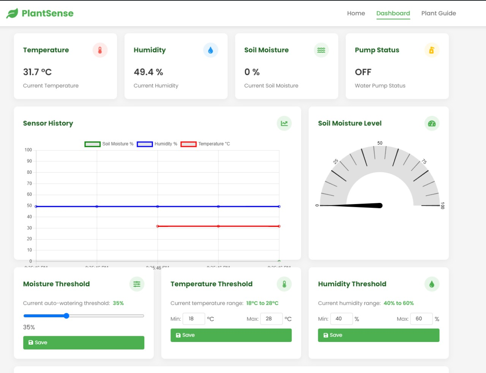
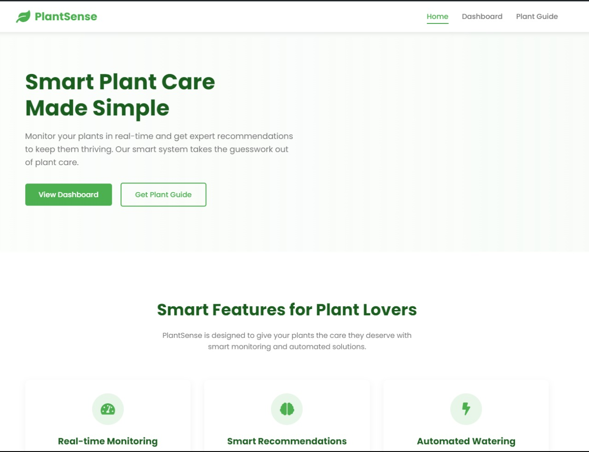

# IoT-Based-Plant-Monitoring-System
# PlantSense - Smart Plant Care Dashboard

## What is this project?

**PlantSense** is a smart plant monitoring and automation system. It allows users to monitor real-time plant data (soil moisture, temperature, humidity), control a water pump, set thresholds, and receive notifications—all through a modern, responsive web dashboard. The system is designed to help plant owners keep their plants healthy with minimal effort.

## What I Did

### Frontend Development

- **Designed and built a responsive dashboard** using HTML, CSS, and JavaScript.
- **Implemented real-time data visualization** with Chart.js and Gauge.js for sensor data (soil moisture, temperature, humidity).
- **Created interactive UI components**:
  - Plant selection dropdown with search and auto-threshold population.
  - Threshold sliders and input fields for moisture, temperature, and humidity.
  - Manual/auto mode toggle for pump control.
  - Notification settings with email integration.
- **Integrated Firebase Realtime Database** for live sensor data, control commands, and settings.
- **Added alert and notification system**:
  - Email notifications using EmailJS.
  - Visual and audio alerts for critical plant conditions.
- **Built a Plant Care Guide page** with care tips and benefits, styled for readability and engagement.
- **Ensured mobile responsiveness** and accessibility across devices.
- **Used modern CSS techniques** (CSS Grid, Flexbox, custom properties) for layout and theming.
- **Focused on clean, maintainable code** and user-friendly design.

### Why this is helpful for my frontend engineer journey

- **Real-world dashboard experience**: Built a full-featured, interactive dashboard from scratch.
- **Data-driven UI**: Learned to handle real-time data updates and state management in the browser.
- **API and service integration**: Connected frontend to Firebase and third-party services (EmailJS).
- **UI/UX best practices**: Practiced designing for usability, clarity, and responsiveness.
- **Component-based thinking**: Broke down UI into reusable, manageable pieces.
- **Problem-solving**: Handled async data, error states, and user feedback.
- **Portfolio-ready**: Demonstrates ability to deliver a complete, polished frontend project.

---

## How to Run

1. Open `index.html` for the landing page.
2. Use `dashboard.html` for the main plant monitoring dashboard.
3. Explore `recommendations.html` for plant care tips and guides.
4. The dashboard connects to Firebase for live data (requires backend/Arduino setup for full functionality).

---

## Technologies Used

- HTML5, CSS3 (with Flexbox, Grid, custom properties)
- JavaScript (ES6+)
- [Chart.js](https://www.chartjs.org/) for charts
- [Gauge.js](https://bernii.github.io/gauge.js/) for gauges
- [Firebase Realtime Database](https://firebase.google.com/)
- [EmailJS](https://www.emailjs.com/) for notifications
- Font Awesome for icons
- Google Fonts (Poppins)

---

## Screenshots

- 
- 

---

## License

This project is for learning and portfolio purposes.

